# Release Workflows

This directory contains automated workflows for managing releases of `react-native-google-fit`.

## Workflows

### 1. `create-release-branch.yml` - Create Release Branch

**Trigger:** Manual (workflow_dispatch)

**Purpose:** Creates a release branch and git tag

**Steps:**
1. Calculates new version (patch/minor/major)
2. Creates `release/vX.Y.Z` branch
3. Creates and pushes git tag `vX.Y.Z`
4. Provides instructions for next steps

**How to use:**
1. Go to Actions → "Create Release Branch"
2. Click "Run workflow"
3. Select version bump type (patch/minor/major)
4. Click "Run workflow"
5. Go to GitHub Releases and manually publish the release

### 2. `release-published.yml` - Release Published Handler

**Trigger:** Automatic (when you publish a release on GitHub)

**Purpose:** Creates PR to update package.json and CHANGELOG.md

**Steps:**
1. Gets version and release notes from the published release
2. Updates package.json with new version
3. Updates CHANGELOG.md with release notes
4. Creates `release-pr/vX.Y.Z` branch
5. Opens PR to master

**How it works:**
- Automatically runs when you publish a release on GitHub
- Uses the release notes you generated/edited on GitHub
- Creates a clean PR with version bump and changelog update

### 3. `publish-npm.yml` - Publish to npm

**Trigger:** Automatic (when release PR is merged)

**Purpose:** Publishes the package to npm

**Steps:**
1. Validates the PR came from a `release-pr/*` branch
2. Checks out master (now has updated package.json)
3. Installs dependencies
4. Publishes to npm
5. Comments on PR with success links

**How it works:**
- Automatically runs when a release PR is merged
- Publishes from master ensuring version is correct
- Posts npm links as a comment

## Release Process

```
┌─────────────────────────────────────────┐
│  1. Create Branch & Tag (Manual)        │
│     • Actions → "Create Release Branch" │
│     • Select patch/minor/major          │
│     • Creates release/vX.Y.Z branch     │
│     • Creates vX.Y.Z tag                │
└─────────────────┬───────────────────────┘
                  │
                  ▼
┌─────────────────────────────────────────┐
│  2. Publish Release (Manual)            │
│     • Go to GitHub Releases             │
│     • Click "Draft a new release"       │
│     • Select tag vX.Y.Z                 │
│     • Click "Generate release notes"    │
│     • Edit if needed                    │
│     • Click "Publish release"           │
└─────────────────┬───────────────────────┘
                  │
                  ▼
┌─────────────────────────────────────────┐
│  3. Auto PR Created (Automatic)         │
│     • Triggered by release published    │
│     • Updates package.json version      │
│     • Updates CHANGELOG.md              │
│     • Opens PR to master                │
└─────────────────┬───────────────────────┘
                  │
                  ▼
┌─────────────────────────────────────────┐
│  4. Review & Merge PR (Manual)          │
│     • Review the version bump           │
│     • Approve and merge PR              │
└─────────────────┬───────────────────────┘
                  │
                  ▼
┌─────────────────────────────────────────┐
│  5. Publish to npm (Automatic)          │
│     • Triggered by PR merge             │
│     • Publishes from master             │
│     • Comments on PR with links         │
└─────────────────────────────────────────┘

```mermaid
flowchart TD
    Start([Start Release]) --> Manual1[/"👤 Step 1: Create Release Branch<br/>(Manual - GitHub Actions)"/]
    
    Manual1 --> Action1["🔧 Workflow: create-release-branch.yml<br/>• Calculate new version<br/>• Create release/vX.Y.Z branch<br/>• Push git tag vX.Y.Z"]
    
    Action1 --> Manual2[/"👤 Step 2: Publish Release<br/>(Manual - GitHub UI)"/]
    
    Manual2 --> Action2["📝 On GitHub Releases:<br/>• Draft new release<br/>• Select tag vX.Y.Z<br/>• Generate release notes<br/>• Edit if needed<br/>• Publish release"]
    
    Action2 --> Auto1["⚡ Workflow: release-published.yml<br/>(Automatic)<br/>• Get release notes<br/>• Update package.json<br/>• Update CHANGELOG.md<br/>• Create release-pr/vX.Y.Z branch<br/>• Open PR to master"]
    
    Auto1 --> Manual3[/"👤 Step 3: Review & Merge PR<br/>(Manual)"/]
    
    Manual3 --> Action3["✅ Review PR:<br/>• Verify version bump<br/>• Check CHANGELOG<br/>• Approve & merge"]
    
    Action3 --> Auto2["⚡ Workflow: publish-npm.yml<br/>(Automatic)<br/>• Validate PR branch<br/>• Install dependencies<br/>• Publish to npm<br/>• Comment on PR with links"]
    
    Auto2 --> Done([✨ Release Complete!])
    
    classDef manualStep fill:#e1f5ff,stroke:#0366d6,stroke-width:2px
    classDef autoStep fill:#f0fff4,stroke:#22863a,stroke-width:2px
    classDef actionStep fill:#fff5b1,stroke:#f9c513,stroke-width:1px
    
    class Manual1,Manual2,Manual3 manualStep
    class Auto1,Auto2 autoStep
    class Action1,Action2,Action3 actionStep
```


## Benefits

✅ **Simple** - Clear, straightforward process  
✅ **Native GitHub Features** - Uses GitHub's auto-generated release notes  
✅ **Manual Control** - You publish the release when ready  
✅ **Automated** - PR and npm publish happen automatically  
✅ **Auditable** - Full PR history + GitHub releases  
✅ **Flexible** - Edit release notes on GitHub before publishing  
✅ **Safe** - Version bump reviewed in PR before npm publish  

## Testing

See [docs/development/testing-github-actions-workflow.md](/docs/development/testing-github-actions-workflow.md) for detailed testing instructions.

## Troubleshooting

### Branch/tag not created
- Check workflow run logs in Actions tab
- Ensure you have proper permissions
- Verify tag doesn't already exist

### PR not created after publishing release
- Verify you published the release (not saved as draft)
- Check "Release Published" workflow logs in Actions tab
- Ensure the tag exists and matches the release

### npm publish didn't run
- Verify PR was from a `release-pr/*` branch
- Check that PR was merged (not just closed)
- Review "Publish to npm" workflow logs in Actions tab

### npm publish failed
- Verify `NPM_TOKEN` secret is set
- Check that version doesn't already exist on npm
- Ensure master has the updated package.json
- Review npm publish logs in workflow output

## Required Secrets

- `NPM_TOKEN` - npm authentication token with publish access

Set this in: Repository Settings → Secrets and variables → Actions → New repository secret

